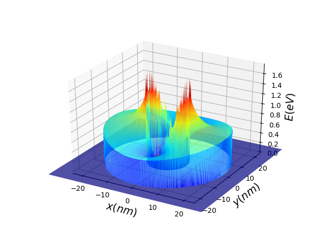

# PyEfield

A Python-based Machine Learning (ML) algorithm for the calculation of Efiled around gold-silica nanoparticlers.

************************************************************
Developed by Mohsen Tamtaji (mtamtaji@connect.ust.hk) under the supervision of Professor Zhengtang Tom Luo at HKUST, [Advanced Materials & Devices Laboratory](https://tomluogroup.wixsite.com/nanomaterials)

The developed ML algorithm can be used for the prediction of electric field around gild-silica nanoparticles. 

Deep neural networks (DNN) is trained based on FDTD-calculated data.

The ML model is also applicable for the calculation of HOMO-LUMO energy levels and Jablonski diagrams of several photosensitizers in the presence of electric field. The data are from TD-DFT calculations using Gaussian 09. 

************************************************************

************************************************************

# Requirments and Dependencies:

PyEfield needs the following pakages:

1-[pickle](https://scikit-learn.org/stable/install.html)

2- [matplotlib](https://matplotlib.org/stable/users/installing/index.html)

3- [numpy](https://numpy.org/install/)

************************************************************

# Running PyEfield:

Note: There is not "pip install" of this version yet, so you need to download the ML algorithm and run the program as follows:

1- Download the **TNNEfield2.pickle**, **Roriginal.pkl**, and **Eoriginal.pkl** files into your directory

2- Download the **TNNEfield4.py** and put into your directory, open in your PyCharm, Spider, or other Python environments, change the directory (**Location**) and filename in the **TNNEfield4.py** file and run the code. The program will plot the electric filed for gold-silica core-shell nanoparticles.

3- Enjoy :)

************************************************************

# Citation:

For the citation, please cite the following papers:

1- DOI: [10.1039/D1TA08337F](https://pubs.rsc.org/en/content/articlehtml/2022/ta/d1ta08337f)

2- https://doi.org/10.1021/acsanm.1c01436
